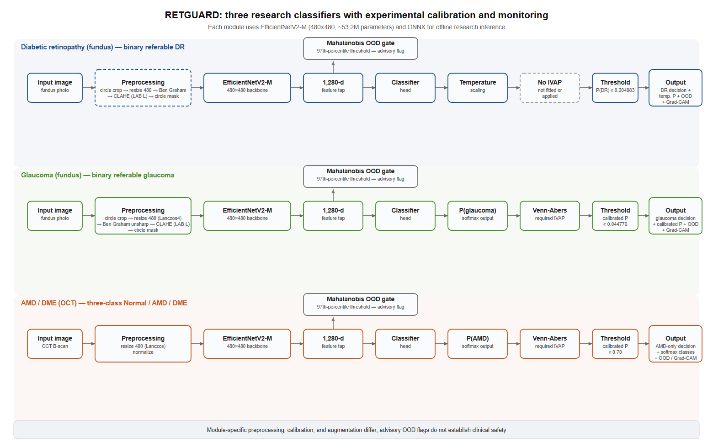

# RETGUARD

Calibrated, out-of-distribution-aware retinal research models — referable diabetic retinopathy and glaucoma from fundus photographs, AMD/DME from OCT B-scans — released as ONNX exports (per-module export-verification status is disclosed in the model cards) with experimental calibration and monitoring components: temperature/Venn-Abers calibration, a Mahalanobis OOD flag, and pre-specified decision thresholds. These components do not establish clinical safety. The OCT Boolean decision is AMD-only and is not a DME-inclusive referral decision.

[](LICENSE.md)
[](pyproject.toml)
[](https://github.com/anchor-neuro/retguard/actions/workflows/ci.yml)

Manuscript in preparation — see [Citation](#citation) · [Model cards](docs/) · [Weights (v1.0.0 release)](https://github.com/anchor-neuro/retguard/releases/tag/v1.0.0) · [Commercial licensing](COMMERCIAL-LICENSE.md)



## Results

| Module | Modality | Task | Primary external result |
|---|---|---|---|
| dr | Fundus | Referable diabetic retinopathy | Messidor-2 (n=1,744, zero-shot): AUC 0.9691 (95% CI 0.9595–0.9772); sensitivity 97.16% (95.45–98.51%), specificity 76.07% (73.71–78.32%) at the pre-specified threshold |
| glaucoma | Fundus | Referable glaucoma | REFUGE-Val (n=400, zero-shot): AUC 0.9278 (0.8642–0.9763); ORIGA (n=650, zero-shot): AUC 0.8729 (0.8399–0.9028), both under minimal preprocessing |
| oct | OCT B-scan | Normal / AMD / DME | OCTID (n=261, external; 55 AMD positives, no DME cases): AMD-vs-rest AUC 0.9999 (0.9995–1.0000). The archived Duke performance claim was withdrawn after the released-model reproduction gate failed. |

CIs are bootstrap percentile intervals. Full evaluation — internal, dataset-family-holdout, and failure-mode results — is in the paper and the [model cards](docs/).

## Known failure modes

Reported with the same prominence as the results above, because they define where the system must not be used:

- The glaucoma module fails on optic-disc crops: on RIM-ONE DL it performs below chance (AUC 0.3667). It is a full-fundus classifier; cropped inputs are out of intended use.
- Cropped fields of view degrade it: ACRIMA AUC 0.7185 (minimal preprocessing) / 0.6049 (training-domain preprocessing).
- The OCT module's "Normal" output means "no AMD or DME detected", not "healthy": in a 354-image confounder test (epiretinal membrane, retinal artery/vein occlusion, vitreomacular interface disease), 347 of 354 non-target pathologies were output as Normal.
- No validated strictly external DME performance estimate remains. The archived Duke DME and AMD results were withdrawn after none of six documented released-model preprocessing/TTA/score variants reproduced the reported Duke AUC.
- The DR module's calibration exceeds the project's own 0.05 expected-calibration-error gate (calibration-set ECE 0.052537; 0.0811 on Messidor-2).
- One glaucoma result (ORIGA under training-domain preprocessing, AUC 0.9988) is far above the comparative values identified in the manuscript's literature search and remains unconfirmed pending independent replication.
- The DR module's ONNX export failed its prespecified logit-parity tolerance (maximum logit difference 0.002526 against a 0.001 threshold) in a six-sample check. The observed maximum probability difference was 0.000626, but that small check does not establish a global bound on decision impact; the released export remains unverified against the failed logit criterion.

## Installation

```
pip install "git+https://github.com/anchor-neuro/retguard@v1.1.1"
retguard download --module all
```

Supported environment: Python 3.10–3.12, CPU-only inference via onnxruntime. No GPU is required.

## Quickstart

No sample images are bundled; supply your own retinal OCT B-scan. The Kermany OCT dataset (Mendeley Data, doi:10.17632/rscbjbr9sj.2, CC BY 4.0) is a public source. With a B-scan saved as `oct_bscan.jpeg`:

```python
import retguard

predictor = retguard.load("oct")
result = predictor.predict("oct_bscan.jpeg")
print(result.class_probabilities, result.decision, result.ood_flagged)
```

The CLI equivalent:

```
retguard download --module oct
retguard predict --module oct oct_bscan.jpeg --json
```

Runnable scripts for both modalities are in [`examples/`](examples/).

## Local demo

```
pip install "retguard[ui] @ git+https://github.com/anchor-neuro/retguard@v1.1.1"
retguard serve
```

The browser UI runs each module on an uploaded image and renders the out-of-distribution status, the decision at the pre-specified threshold, the calibrated probability (with the Venn-Abers interval where the module deploys one), and a saliency heatmap. The demo is research-use only and fully offline; no image leaves the machine.

The saliency view is exact Grad-CAM computed from the shipped ONNX graph (closed-form head gradient, identity view, last convolutional layer), verified against the torch reference pipeline at Spearman rank correlation 1.000000 on 15 image/module pairs. It is an attribution map, not clinical localization and not clinical evidence.

## Model weights

| Module | Release asset | Size (bytes) | SHA-256 of the model file |
|---|---|---|---|
| dr | `retguard-dr-v1.0.0.zip` | 204,707,438 | `retguard_dr_v1.0.0.onnx`: `f0e19fa86d5a27a05731550d1d6708c01f6f363f45a1fa57849de988f91e775b` |
| glaucoma | `retguard-glaucoma-v1.0.0.zip` | 204,819,003 | `retguard_glaucoma_v1.0.0.onnx`: `b5686229ecc9050caddf61a66686e77e3e5cb4085425cca881078acb586cbb7b` |
| oct | `retguard-oct-v1.0.0.zip` | 204,678,963 | `retguard_oct_v1.0.0.onnx`: `5ebd2e814a718edca922c26f5bdce380c6b38506f923103a8cb3362b67fb75f3`; `retguard_oct_v1.0.0.onnx.data`: `88d6c4d6803d3201b182eeb528b9ab08f2641de2b1d1ef672c807f9ecda5243c` |

Each zip additionally contains the module's OOD-gate `.npz`, the Venn-Abers calibrator `.npz` where the module deploys one (glaucoma, oct), `LICENSE.txt`, and the module's model card. Weights are distributed via the [v1.0.0 release](https://github.com/anchor-neuro/retguard/releases/tag/v1.0.0), never via the git tree. SHA-256 digests for every zip and member file are published in the release's `SHA256SUMS.txt` and embedded in `retguard/weights.py`; `retguard download` verifies them automatically, and `retguard verify` re-checks an existing installation. The v1.1.1 source/UI/documentation release has no model assets and uses these unchanged v1.0.0 archives.

## Distribution status

The authenticated GitHub v1.0.0 release is currently the only verified public weight distribution. A Hugging Face mirror and hosted Space are planned but must not be treated as public until their anonymous endpoints are verified.

## Model cards

- [`docs/MODEL_CARD_dr.md`](docs/MODEL_CARD_dr.md) — referable diabetic retinopathy from fundus photographs.
- [`docs/MODEL_CARD_glaucoma.md`](docs/MODEL_CARD_glaucoma.md) — referable glaucoma from full fundus photographs.
- [`docs/MODEL_CARD_oct.md`](docs/MODEL_CARD_oct.md) — three-class Normal/AMD/DME from OCT B-scans.

The cards document every known limitation and every value the internal structured verification could not trace to an artifact.

## Intended use and limitations

RETGUARD is a research artifact. It is not a medical device, has no regulatory clearance in any jurisdiction, and must not be used for clinical diagnosis, screening, triage, or patient management. All reported evidence is retrospective and computed on research datasets with varied access conditions; no prospective validation and no validation on a target camera or OCT device has been performed. The intended-use sections of the model cards govern.

## License

| Artifact class | License | File |
|---|---|---|
| Source code | PolyForm Noncommercial 1.0.0 | [LICENSE.md](LICENSE.md) |
| Weights, companion artifacts, figures, model cards, documentation | CC BY-NC 4.0 | [LICENSE-WEIGHTS.md](LICENSE-WEIGHTS.md) |
| Commercial use | Separate written agreement | [COMMERCIAL-LICENSE.md](COMMERCIAL-LICENSE.md) |

This repository is source-available for research use, released under a research-use (noncommercial) license structure. A 90-day internal-evaluation permission for organizations considering a commercial license is included in [COMMERCIAL-LICENSE.md](COMMERCIAL-LICENSE.md).

The released weights were trained on research datasets obtained through access routes and terms available to the developer at the time. Access conditions vary, and several reviewed sources do not expressly establish redistribution rights for learned weights or commercial use. Any commercial deployment requires rights-holder review or retraining on appropriately licensed data. Per-dataset provenance, access category, and verified rights are given in the manuscript's supplementary appendix.

## Citation

```bibtex
@misc{aboelmaaty2026retguard,
  author  = {Aboelmaaty, Sameh},
  title   = {{RETGUARD}: Retrospective Multi-Dataset Development and External
             Testing of Calibrated Deep-Learning Classifiers for Retinal Fundus
             Photographs and OCT B-Scans},
  note    = {Manuscript in preparation},
  year    = {2026}
}
```

Or use GitHub's "Cite this repository" button, which reads [CITATION.cff](CITATION.cff).

## Acknowledgements and contact

This work builds on research datasets with varied self-service, account-gated, challenge, and request-based access conditions: EyePACS, DDR, APTOS, IDRiD, DeepDRiD, Messidor-2, AIROGS, G1020, REFUGE, ORIGA, DRISHTI-GS, FIVES, RIM-ONE DL, ACRIMA, Kermany, Noor, OCTDL, Duke/Srinivasan, and OCTID. Each dataset's verified terms and unresolved rights are summarized in the manuscript appendix.

Sameh Aboelmaaty — ghoneim2012@gmail.com — Anchor Neuro, Delaware, USA.

Competing interests: the author developed RETGUARD and founded Anchor Neuro, which may commercialize the system.
